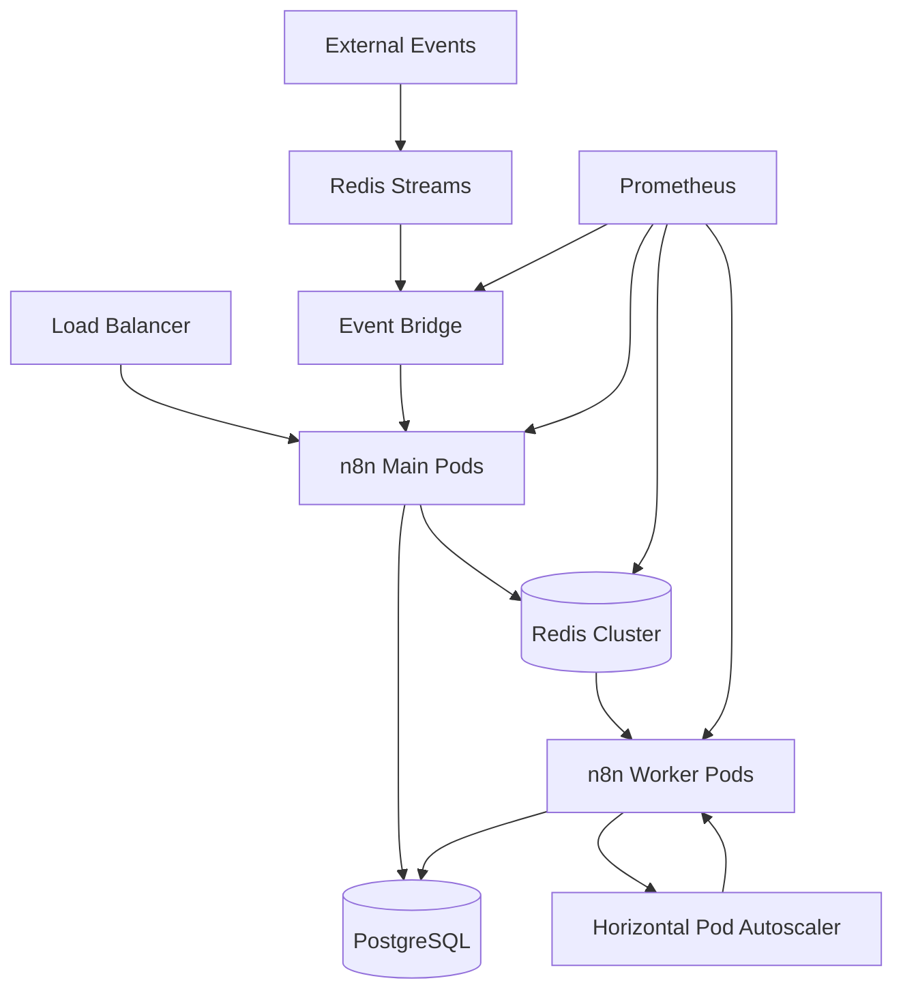

# n8n Scalable Deployment Guide

## Overview

This guide provides comprehensive instructions for deploying n8n in a highly scalable, production-ready configuration across multiple cloud platforms. The deployment features:

- **Queue Mode with Redis Streams**: Modern event-driven architecture
- **Horizontal Pod Autoscaling**: Automatic scaling based on demand
- **Multi-Platform Support**: AWS EKS, Azure AKS, Docker Desktop/Minikube
- **Infrastructure as Code**: Terraform for repeatable deployments
- **Monitoring & Observability**: Prometheus, Grafana, and custom metrics

## Architecture Overview



## Components

### Core Components

1. **n8n Main Pods** (2 replicas)
   - Handle UI, API, and webhook requests
   - Schedule workflows and manage the queue
   - Deployed on dedicated node group with taints

2. **n8n Worker Pods** (3-20 replicas, auto-scaled)
   - Execute workflow jobs from the queue
   - Scale automatically based on CPU, memory, and queue depth
   - Run on spot instances for cost optimization

3. **Redis Cluster** (Master + 2 Replicas)
   - BullMQ job queue for n8n
   - Redis Streams for event ingestion
   - High availability with automatic failover

4. **Event Bridge Service**
   - Connects Redis Streams to n8n webhooks
   - Handles multiple event streams concurrently
   - Provides metrics and health monitoring

5. **PostgreSQL Database**
   - Stores n8n workflow definitions and execution history
   - Automated backups and point-in-time recovery
   - Optimized for workflow metadata storage

## Quick Start

### Prerequisites

- Kubernetes cluster (EKS/AKS/Minikube)
- Helm 3.x
- kubectl
- Terraform 1.x (for infrastructure deployment)

### 1. Deploy Infrastructure (AWS EKS Example)

```bash
cd aws-eks/terraform

# Initialize Terraform
terraform init

# Review and apply infrastructure
terraform plan -var-file="environments/dev.tfvars"
terraform apply -var-file="environments/dev.tfvars"

# Configure kubectl
aws eks update-kubeconfig --region us-west-2 --name n8n-dev
```

### 2. Install Prerequisites

```bash
# Add required Helm repositories
helm repo add bitnami https://charts.bitnami.com/bitnami
helm repo add ingress-nginx https://kubernetes.github.io/ingress-nginx
helm repo add jetstack https://charts.jetstack.io
helm repo update

# Install NGINX Ingress Controller
helm install ingress-nginx ingress-nginx/ingress-nginx \
  --namespace ingress-nginx \
  --create-namespace \
  --set controller.service.type=LoadBalancer

# Install cert-manager
helm install cert-manager jetstack/cert-manager \
  --namespace cert-manager \
  --create-namespace \
  --set installCRDs=true

# Install metrics-server (if not present)
kubectl apply -f https://github.com/kubernetes-sigs/metrics-server/releases/latest/download/components.yaml
```

### 3. Deploy n8n

```bash
# Create namespace
kubectl create namespace n8n

# Deploy using Helm
helm install n8n-scalable shared/helm/ \
  --namespace n8n \
  --values aws-eks/helm/values-aws.yaml \
  --wait
```

### 4. Verify Deployment

```bash
# Check pod status
kubectl get pods -n n8n

# Check HPA status
kubectl get hpa -n n8n

# Check ingress
kubectl get ingress -n n8n

# Access n8n UI
kubectl port-forward -n n8n svc/n8n-main 8080:5678
# Open http://localhost:8080
```

## Platform-Specific Deployments

### AWS EKS

**Features:**
- Managed Kubernetes with AWS EKS
- ElastiCache Redis for high performance
- RDS PostgreSQL with automated backups
- Application Load Balancer integration
- Spot instances for cost optimization

**Deployment Steps:**

1. **Infrastructure Setup**
```bash
cd aws-eks/terraform
terraform init
terraform apply -var-file="environments/prod.tfvars"
```

2. **Configure kubectl**
```bash
aws eks update-kubeconfig --region us-west-2 --name n8n-prod
```

3. **Deploy Applications**
```bash
# Install AWS Load Balancer Controller
kubectl apply -k aws-eks/kubernetes/aws-load-balancer-controller/

# Deploy n8n
helm install n8n-scalable shared/helm/ \
  --namespace n8n \
  --values aws-eks/helm/values-aws.yaml
```

**AWS-Specific Configuration:**
- Uses ElastiCache Redis Cluster
- RDS PostgreSQL with Multi-AZ
- AWS Secrets Manager integration
- CloudWatch monitoring
- ALB Ingress with SSL termination

### Azure AKS

**Features:**
- Managed Kubernetes with Azure AKS
- Azure Cache for Redis
- Azure Database for PostgreSQL
- Azure Application Gateway integration
- Virtual Machine Scale Sets

**Deployment Steps:**

1. **Infrastructure Setup**
```bash
cd azure-aks/terraform
terraform init
terraform apply -var-file="environments/prod.tfvars"
```

2. **Configure kubectl**
```bash
az aks get-credentials --resource-group n8n-prod-rg --name n8n-prod-aks
```

3. **Deploy Applications**
```bash
# Install Application Gateway Ingress Controller
kubectl apply -k azure-aks/kubernetes/application-gateway-ingress/

# Deploy n8n
helm install n8n-scalable shared/helm/ \
  --namespace n8n \
  --values azure-aks/helm/values-azure.yaml
```

### Docker Desktop / Minikube

**Features:**
- Local development environment
- Simple Redis and PostgreSQL deployments
- NodePort services for local access
- Reduced resource requirements

**Deployment Steps:**

1. **Start Minikube**
```bash
minikube start --cpus=4 --memory=8g --driver=docker
minikube addons enable ingress
minikube addons enable metrics-server
```

2. **Deploy n8n**
```bash
helm install n8n-scalable shared/helm/ \
  --namespace n8n \
  --create-namespace \
  --values docker-desktop/helm/values-local.yaml
```

3. **Access Services**
```bash
# Get Minikube IP
minikube ip

# Port forward for direct access
kubectl port-forward -n n8n svc/n8n-main 8080:5678
```

## Configuration

### Environment Variables

| Variable | Description | Default |
|----------|-------------|---------|
| `EXECUTIONS_PROCESS` | Execution mode (main/queue/worker) | `queue` |
| `QUEUE_BULL_REDIS_HOST` | Redis host for queue | `redis-master` |
| `REDIS_STREAMS_ENABLED` | Enable Redis Streams integration | `true` |
| `N8N_METRICS` | Enable Prometheus metrics | `true` |
| `QUEUE_BULL_CONCURRENCY` | Worker concurrency level | `10` |

### Scaling Configuration

```yaml
# HPA Configuration
n8n:
  worker:
    autoscaling:
      enabled: true
      minReplicas: 2
      maxReplicas: 20
      targetCPUUtilizationPercentage: 70
      targetMemoryUtilizationPercentage: 80
      behavior:
        scaleUp:
          stabilizationWindowSeconds: 0
          policies:
          - type: Percent
            value: 100
            periodSeconds: 15
```

### Redis Streams Configuration

```yaml
# Event Bridge Configuration
eventBridge:
  enabled: true
  env:
    STREAM_NAMES: "retell-events,twilio-events,property-events"
    CONSUMER_GROUP: "n8n-consumers"
    BLOCK_TIME: "5000"
```

## Testing

### Running Test Suite

```bash
# Deploy test framework
kubectl apply -f shared/tests/

# Run all tests
kubectl exec -n n8n-test test-runner -- ./run-tests.sh --all

# Run specific test categories
kubectl exec -n n8n-test test-runner -- ./run-tests.sh --category scalability

# Run load tests
kubectl exec -n n8n-test test-runner -- ./run-tests.sh --load-test --duration 300s
```

### Test Categories

1. **Health Tests**: Basic connectivity and service health
2. **Queue Tests**: BullMQ job processing verification
3. **Streams Tests**: Redis Streams and Event Bridge functionality
4. **Scalability Tests**: HPA and performance under load
5. **Resilience Tests**: Failure scenarios and recovery
6. **Performance Tests**: Latency and throughput measurements

### Load Testing

```bash
# Generate high load for HPA testing
kubectl run load-generator --image=busybox --restart=Never -- \
  /bin/sh -c "while true; do wget -O- -q http://n8n-main:5678/healthz; done"

# Monitor scaling
watch kubectl get hpa -n n8n
watch kubectl get pods -n n8n
```

## Monitoring

### Prometheus Metrics

Key metrics to monitor:

- `n8n_executions_total`: Total workflow executions
- `bull_jobs_completed_total`: Completed queue jobs
- `bull_queue_size`: Current queue depth
- `eventbridge_events_processed_total`: Processed stream events
- `redis_connected_clients`: Redis client connections

### Grafana Dashboards

Import dashboards from `shared/monitoring/grafana-dashboards/`:

1. **n8n Overview**: General system health and performance
2. **Queue Monitoring**: BullMQ metrics and worker performance
3. **Redis Streams**: Event processing and throughput
4. **Infrastructure**: Node and pod resource utilization

### Alerting Rules

```yaml
# Example alert for high queue depth
- alert: N8nHighQueueDepth
  expr: bull_queue_size > 100
  for: 5m
  labels:
    severity: warning
  annotations:
    summary: "n8n queue depth is high"
    description: "Queue has {{ $value }} jobs waiting"
```

## Production Considerations

### Security

1. **Network Policies**: Restrict pod-to-pod communication
2. **RBAC**: Minimal required permissions
3. **Secrets Management**: Use external secret stores
4. **TLS**: Enable encryption in transit
5. **Pod Security**: Run as non-root user

### Performance Optimization

1. **Resource Requests/Limits**: Set appropriate values
2. **Node Affinity**: Separate workloads across nodes
3. **Persistent Volumes**: Use high-performance storage
4. **Connection Pooling**: Optimize database connections
5. **Caching**: Enable Redis caching for frequently accessed data

### Backup and Recovery

1. **Database Backups**: Automated PostgreSQL backups
2. **Redis Persistence**: Configure RDB and AOF
3. **Workflow Export**: Regular workflow definitions backup
4. **Disaster Recovery**: Multi-region deployment strategy

## Troubleshooting

### Common Issues

1. **Pods Not Scaling**
   - Check HPA configuration
   - Verify metrics-server is running
   - Review resource requests/limits

2. **Queue Jobs Not Processing**
   - Check Redis connectivity
   - Verify worker pod logs
   - Review queue configuration

3. **Event Bridge Not Consuming**
   - Check Redis Streams creation
   - Verify consumer group configuration
   - Review Event Bridge logs

### Debug Commands

```bash
# Check pod logs
kubectl logs -n n8n deployment/n8n-worker -f

# Check HPA status
kubectl describe hpa -n n8n n8n-worker

# Check Redis connectivity
kubectl exec -n n8n redis-master-0 -- redis-cli ping

# Check metrics
kubectl port-forward -n n8n svc/n8n-worker 9464:9464
curl http://localhost:9464/metrics
```

## Contributing

1. Fork the repository
2. Create a feature branch
3. Add tests for new functionality
4. Ensure all tests pass
5. Submit a pull request

## Support

For issues and questions:
- GitHub Issues: [Repository Issues](https://github.com/your-org/n8n-scalable)
- Documentation: [Wiki](https://github.com/your-org/n8n-scalable/wiki)
- Community: [Discord Channel](https://discord.gg/n8n-community) 